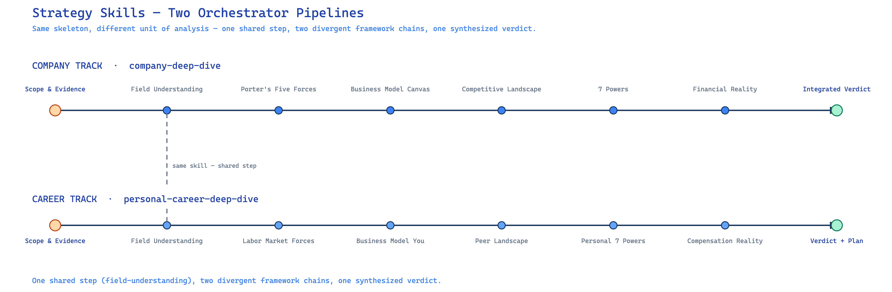

# Strategy Stack Skills

Framework-based strategic analysis for **companies** and **careers**, packaged as a
Claude plugin.

Nine skills. Two end-to-end orchestrators that chain component frameworks in dependency
order, so each framework runs on grounded evidence instead of in a vacuum. A test suite
that fails the build when a skill references a sibling that no longer exists.

---

## What this helps with

Strategic analysis is usually either a slide deck built by hand, or a chat with an LLM
that produces confident-sounding output ungrounded in any real facts about the market or
the company. This plugin is for people who want the second option done properly.

**Who it's for**

- Founders and PMs deciding whether to enter a market or build a feature
- Operators sizing up a competitor's moat
- Individuals evaluating a job change or figuring out what makes them hard to replace

**What it does**

- Tells you whether a market is structurally attractive and whether a specific product or
  feature has a durable moat, against named competitors — not a generic SWOT list
- Maps how a company actually makes money, block by block, and stress-tests whether the
  pieces are coherent
- Runs the same two analyses on a career instead of a company — what you offer, to whom,
  and whether that's defensible or commoditized
- Turns any of the above into a phased roadmap where every initiative traces back to a
  specific finding, not a guess

**Why it's needed**

The failure mode above is the default one, and it shows up the same way in all three
frameworks this plugin implements:

- Porter's Five Forces applied cold produces force ratings generic enough to describe
  almost any market, because nothing grounds it in this market's actual value chain or
  names this market's actual rivals
- A 7 Powers assessment without named competitors produces a list of strengths, not a
  moat argument — a Power only means something relative to a specific rival
- A Business Model Canvas filled in block by block, with nothing checking the blocks
  against each other, produces nine plausible-sounding boxes that don't add up to one
  coherent business

See [Why it is built this way](#why-it-is-built-this-way) for how this plugin closes each
of those gaps.

---

## Try it

Two worked demos, one per track — each lists the phase chain and a checklist of what a
correct output contains, so they double as readable regression tests.

- [`examples/business/`](examples/business/) — full company analysis
- [`examples/personal-career/`](examples/personal-career/) — the career mirror

---

## The books behind the frameworks

None of the frameworks here are original — the contribution is the dependency
enforcement and the tooling around them, not the strategy theory itself. Each skill is a
faithful implementation of a specific published framework:

| Framework | Book | Used by |
|---|---|---|
| Five Forces | Michael E. Porter, *Competitive Strategy: Techniques for Analyzing Industries and Competitors* (1980) | `ai-product-forces-and-powers` |
| 7 Powers | Hamilton Helmer, *7 Powers: The Foundations of Business Strategy* (2016) | `ai-product-forces-and-powers`, `personal-power-analysis` |
| Business Model Canvas | Alexander Osterwalder & Yves Pigneur, *Business Model Generation* (2010) | `business-model-canvas`, `business-model-you` |

Two implementation choices worth knowing about going in:

- **7 Powers is comparative, not abstract.** Helmer defines a Power as a condition that
  lets a business earn persistent differential returns, and a Power claim only means
  something next to a named rival. `ai-product-forces-and-powers` and
  `personal-power-analysis` both require 2–3 named competitor products (or peers) as
  comparison foils — a strength with no named foil is graded as commodity, not a Power.
- **The Canvas is a mirror, not a fixed template.** `business-model-you` is Tim Clark's
  adaptation of Osterwalder & Pigneur's original nine blocks to a single person's career
  (their book, *Business Model You*, builds on the same canvas) — same nine blocks, "you"
  as the business being modeled instead of a firm.

`field-understanding`, the shared first phase both orchestrators run before any of the
above, isn't drawn from one of these three books — it's an original seven-lens briefing
format built for this plugin, described further in
[`docs/PUBLIC_SKILL_COMPARISON.md`](docs/PUBLIC_SKILL_COMPARISON.md).

---

## Why it is built this way

Most strategy prompting fails the same way: a framework gets applied without the facts it
needs. Porter's Five Forces done without knowing the value chain produces force ratings
that could describe any market. Helmer's 7 Powers assessed against "competitors" in the
abstract produces a list of strengths, not a moat analysis. A Business Model Canvas filled
in block by block, with nothing checking the blocks against each other, produces nine
plausible answers that don't add up to one coherent business.

This plugin fixes that with **enforced dependency order and a coherence check**. Field
understanding runs first and emits eight named outputs; every Porter force must cite at
least one of them. The 7 Powers analysis must name specific competitor products as
comparison foils. The Business Model Canvas ends with an explicit coherence-check step —
strengths, weaknesses, and risks read off the completed canvas, not assumed going in. The
roadmap must trace every initiative back to a force or a power finding. Skip a step and the
downstream analysis has nothing to stand on — so the orchestrators don't let you.

---

## The two tracks

A firm and a career are both entities with a value proposition, rivals, and
defensibility. The tracks are deliberate mirrors: same skeleton, different unit of
analysis.

| Layer | Company track | Career track |
|---|---|---|
| **Orchestrator** | `company-deep-dive` | `personal-career-deep-dive` |
| Context | `field-understanding` | `field-understanding` *(shared)* |
| Value machine | `business-model-canvas` | `business-model-you` |
| Defensibility | `ai-product-forces-and-powers` | `personal-power-analysis` |

Learning one track teaches you the other.

---

## Modular architecture

Three layers. **Every layer is independently usable** — you are not required to run an
orchestrator to get value from a component.

```
       ORCHESTRATORS          company-deep-dive        personal-career-deep-dive
                                     │                          │
                              ┌──────┴──────┐            ┌──────┴──────┐
       COMPONENTS             │             │            │             │
                     field-understanding    │   business-model-you     │
                     business-model-canvas  │   personal-power-analysis│
                     ai-product-forces-and-powers                      │
                                     │                          │
       SUPPORT                        sl  ·  grill-me
```

### Layer 1 — Orchestrators
Seven phases, run in dependency order, ending in an integrated verdict. Use when you want
the full picture and are willing to spend the time.

- `company-deep-dive` — scope → field → Porter → canvas → landscape → 7 Powers →
  financials → verdict
- `personal-career-deep-dive` — the same shape for a career, closing with a staged
  action plan



### Layer 2 — Components
Each is a complete analysis on its own, with its own output contract. Call one directly
when you need that specific lens and nothing more.

| Skill | Framework | Answers |
|---|---|---|
| `field-understanding` | 7 lenses | How does this domain actually work? |
| `business-model-canvas` | Osterwalder & Pigneur | How does this company make money? |
| `business-model-you` | BMC adapted to a person | What do I offer, and to whom? |
| `ai-product-forces-and-powers` | Porter + 7 Powers + roadmap | Attractive market? Durable moat? What next? |
| `personal-power-analysis` | 7 Powers adapted to a person | Am I defensible, or replaceable? |

### Layer 3 — Support
Cross-cutting skills the others call as subroutines. Not analyses themselves.

| Skill | Provides |
|---|---|
| `sl` | Iterative research loop: draft → score → name gaps → close → redraft |
| `grill-me` | Interviews you to fill a canvas with real answers instead of guesses |

### Why the layering matters
Components are substitutable. Swap `business-model-canvas` for a different value-machine
framework and the orchestrator still works, because the contract between layers is the
*named outputs*, not the framework. That is what makes this a library rather than seven
long prompts.

---

## Installation

### As a plugin (recommended)

```bash
git clone https://github.com/qiyanjun/strategy-stack-skills.git
```

```bash
claude plugin marketplace add ./strategy-stack-skills
claude plugin install strategy-stack-skills@strategy-stack-skills
```

(Equivalently, from inside an interactive session: `/plugin marketplace add
./strategy-stack-skills` then `/plugin install strategy-stack-skills@strategy-stack-skills`.)

Both steps are required — adding the marketplace only registers it; the plugin still
needs an explicit install before its skills are discovered. Once installed, invoke as
`/company-deep-dive` or namespaced as `/strategy-stack-skills:company-deep-dive`.
Verify with `claude plugin list` (should show `strategy-stack-skills@strategy-stack-skills`,
enabled) or `claude plugin details strategy-stack-skills@strategy-stack-skills` for its
full component inventory and token-cost estimate.

### As individual skills

Copy any skill folder into your skills directory:

```bash
cp -r skills/field-understanding ~/.claude/skills/
```

If you copy a skill that calls siblings — the orchestrators, `business-model-canvas`,
`personal-power-analysis` — copy those too, or its references will not resolve. Run the
validator to see what a given skill depends on.

### As a Codex plugin

```bash
git clone https://github.com/qiyanjun/strategy-stack-skills.git
```

```bash
codex plugin marketplace add ./strategy-stack-skills
codex plugin add strategy-stack-skills@strategy-stack-skills
```

Codex's own plugin CLI (`codex plugin marketplace add` / `codex plugin add`) reads this
repo's existing `.claude-plugin/marketplace.json` and `.claude-plugin/plugin.json`
directly — no Codex-specific manifest needed. Verified end-to-end on `codex-cli 0.154.0`:
`marketplace add` registers the repo, `plugin add` installs it, `codex plugin list` shows
`strategy-stack-skills@strategy-stack-skills` as `installed, enabled`, and its cache copy
includes all nine skills under `skills/`. This isn't documented by OpenAI as a supported
cross-tool path — it works because Codex's plugin loader defaults to a `./skills/` folder
when a manifest doesn't declare one explicitly (the convention official Codex plugins use
via their own `.codex-plugin/plugin.json`), and it happens to also accept a marketplace
manifest under `.claude-plugin/`. Treat it as convenient, not guaranteed to keep working
across Codex releases.

Verify with `codex plugin list` (look for `strategy-stack-skills@strategy-stack-skills`,
`installed, enabled`).

### As Codex skills, without installing

Codex also discovers skills under `.agents/skills/` with no plugin system involved. This
repo ships `.agents/skills` as a symlink to `skills/`, so cloning the repo and running
`codex` from its root picks up all nine skills with no copying — one source of truth,
two discovery paths. Use this if you'd rather not register a marketplace at all.

### Sibling references under either Codex path

Five skills have no sibling references — `field-understanding`, `business-model-you`,
`ai-product-forces-and-powers`, `sl`, `grill-me` — and work as-is under Codex. The other
four (`company-deep-dive`, `personal-career-deep-dive`, `business-model-canvas`,
`personal-power-analysis`) chain to siblings via `${CLAUDE_PLUGIN_ROOT}/skills/<name>/SKILL.md`,
a Claude Code plugin variable Codex does not set. Each of those four now carries an
explicit fallback instruction near its sibling references: when `${CLAUDE_PLUGIN_ROOT}`
is unset, resolve the reference as `<name>/SKILL.md` in the directory next to the current
skill's own directory — true under both Codex paths above, since the sibling layout under
`skills/` is identical either way. This is a plain-language instruction to the model, not
a shell substitution, so it depends on the model actually reading and following it — the
validator can't check that a host followed prose, only that the underlying `<name>` still
resolves to a real skill in this repo (check 5).

### Requirements
Python 3 for the validator only. The skills themselves need no dependencies; web search
improves them substantially but is not required.

---

## Repo layout

```
strategy-stack-skills/
├── .claude-plugin/plugin.json      # plugin manifest — only `name` is required
├── .claude-plugin/marketplace.json # makes `claude plugin marketplace add` work
├── skills/                         # one folder per skill, each with SKILL.md
├── examples/                       # worked demos, one per track
├── docs/PUBLIC_SKILL_COMPARISON.md # how each skill compares to public counterparts
├── docs/images/two-pipelines.png   # the two-orchestrator schematic used above
├── tests/validate_skills.py        # CI gate
├── .github/workflows/validate.yml
└── LICENSE
```

`.claude-plugin/` holds **only manifests** — `plugin.json` (required) and
`marketplace.json` (present because this repo doubles as a one-plugin marketplace, so
`claude plugin marketplace add` has something to find). Everything else lives at the
repo root — skills placed inside `.claude-plugin/` are not discovered.

---

## Design choices

### Flat `skills/`, not layered subdirectories

The README's mental model is three layers — orchestrators, components, support (see
[Modular architecture](#modular-architecture)) — but the directory structure stays flat:
`skills/<name>/SKILL.md` for all ten, with no `skills/orchestrators/`,
`skills/components/`, or `skills/support/` split.

This is deliberate, not an oversight. Claude Code's default skill discovery scans only
the immediate children of `skills/` — it does not recurse into subdirectories. A skill
placed at `skills/orchestrators/company-deep-dive/SKILL.md` would not be discovered at
all, silently, on install. The manifest's `skills` field can register extra nested paths
explicitly, but that trades a purely organizational win (the layering is already fully
documented in the README table) for ongoing maintenance — every new skill's layer folder
would need registering in `plugin.json`, and the validator would need a new check to
catch a skill that's present on disk but missing from that registration. Not worth it for
a distinction that markdown already conveys.

### Plugin name matches the repo name

`plugin.json`'s `"name"` is `strategy-stack-skills`, matching the GitHub repo and remote
exactly. The plugin name also sets the namespaced-invocation prefix
(`/strategy-stack-skills:company-deep-dive`), so letting it drift from the repo name
creates two names for the same thing — confusing to install and to cite.

### This repo doubles as its own marketplace

`.claude-plugin/marketplace.json` lists this repo's single plugin with `"source": "./"`.
This isn't in the official plugin-layout docs cited above — it was found by actually
running `claude plugin marketplace add ./strategy-stack-skills` against a repo that had
only `plugin.json`, which failed with `Marketplace file not found`. The CLI's
`marketplace add` command requires a marketplace manifest even for a single-plugin repo;
a plugin manifest alone isn't enough to make that command work, regardless of what the
docs imply. Verified end-to-end: `marketplace add` → `claude plugin install
strategy-stack-skills@strategy-stack-skills` → `claude plugin list` shows it installed
and enabled with all 9 skills in its component inventory.

### Support skills are reused, not reinvented

`grill-me` and the `sl` research loop are not original to this repo. `grill-me` is a
small, widely-circulated community skill; `sl` implements the same generate → critique →
revise architecture as the published **Self-Refine** and **Reflexion** agent papers, with
an original scoring rubric layered on top. The choice was to compose with a known-good
building block for a cross-cutting concern (interviewing, iterative refinement) rather
than author a bespoke version, and to be explicit about which parts of the plugin are
original versus adopted — see [`docs/PUBLIC_SKILL_COMPARISON.md`](docs/PUBLIC_SKILL_COMPARISON.md)
for the full per-skill accounting.

An earlier version also vendored a third support skill, `excalidraw-diagram`, for
rendering a canvas or value chain as a PNG. It was removed: it was the only skill in the
plugin with a real dependency footprint (Python, `uv`, a ~275MB downloaded Chromium via
Playwright) against the "skills need no dependencies" claim above, it depended at
render-time on an external CDN outside this repo's control, and no orchestrator actually
required it — it was always offered, never assumed. Not worth the maintenance surface for
an optional visual extra.

---

## The portability rule

Skills authored inside Claude reference each other by absolute host path:

```
view /mnt/skills/user/field-understanding/SKILL.md      # ✗ breaks on install
```

Use the plugin root variable instead:

```
view ${CLAUDE_PLUGIN_ROOT}/skills/field-understanding/SKILL.md      # ✓ portable
```

This matters more than it looks: an absolute path fails on a fresh install, and it fails
*silently* — the calling skill improvises rather than erroring. `tests/validate_skills.py`
check 6 fails the build if one shows up.

---

## Validation

```bash
python3 tests/validate_skills.py
```

Six checks:

1. `SKILL.md` exists in every skill directory
2. YAML frontmatter parses, with `name` and `description`
3. frontmatter `name` matches its directory name — a mismatch breaks invocation
4. `description` is within the 1024-character limit
5. every `${CLAUDE_PLUGIN_ROOT}/skills/<x>` reference resolves to a skill in this repo
6. no absolute `/mnt/skills/user/...` paths remain

**Check 5 is the one that earns its keep.** Renaming a skill without updating its callers
is the most common way a cluster like this breaks, and it fails silently at runtime — the
caller falls back to improvised analysis and the output looks plausible. CI runs the
validator on every push.

---

## Contributing

### Naming convention

Names are load-bearing here. The model routes on the name and description alone, so the
name has to signal *what layer a skill sits in*, not just what it is about.

| Layer | Pattern | Examples |
|---|---|---|
| Orchestrator | `<subject>-deep-dive` | `company-deep-dive`, `personal-career-deep-dive` |
| Component | named for its framework or its subject | `business-model-canvas`, `ai-product-forces-and-powers`, `personal-power-analysis`, `field-understanding` |
| Support | named for the action it performs | `sl`, `grill-me` |

**Reserve the `-deep-dive` suffix for orchestrators.** It is the one signal that tells a
multi-phase pipeline apart from a single framework, and it only works while exactly the
pipelines carry it. `field-understanding` is the case that tempts people: it has a Full
Briefing mode with seven lenses, so `field-deep-dive` reads natural — but it is Phase 1
of *both* orchestrators, not a pipeline of its own. Renaming it would put three skills in
competition for "deep dive on X", where X could be a company, a career, or a field.
Component skills stay named for what they are.

Two more rules that fall out of the same logic:

- **Match the name to the trigger vocabulary in the description.** `field-understanding`
  fires on "help me understand X" and "teach me about X"; name and triggers share a word,
  which is why routing to it is reliable. A name that uses none of its own trigger
  phrases is a name that will lose to a sibling.
- **Prefer a stable name over a marginally better one.** A rename costs a save-then-delete
  cycle on the skill side and every caller in this repo, with a window where references
  point at a name that does not exist. `field-understanding` appears 22 times across 9
  files. Rename to fix a collision or an outright error, not to polish.

### Adding a skill

1. `mkdir skills/<kebab-case-name>`, write `SKILL.md` with `name` and `description`
   frontmatter, where `name` equals the directory name and follows the naming convention
   above
2. Reference siblings as `${CLAUDE_PLUGIN_ROOT}/skills/<name>/SKILL.md`
3. **State the boundary in the description** — what this skill is *not* for, and which
   sibling to use instead. Adjacent skills competing for the same request is the main
   failure mode in a cluster this size
4. `python3 tests/validate_skills.py`
5. If the skill belongs in a pipeline, add its phase to the calling orchestrator
6. Bump `version` in `.claude-plugin/plugin.json` (see note below)

**Bump the version on every change, not just new skills.** `claude plugin update` compares
`.claude-plugin/plugin.json`'s `version` field — if it hasn't changed, `update` reports
"already at the latest version" and leaves the installed cache untouched, even though the
directory source has new commits. For a plugin installed from a local directory (this
repo's own recommended install path) that's the only update mechanism available; skipping
the bump means anyone with it installed silently keeps stale content until they uninstall
and reinstall.

### Renaming a skill

Three steps, not one:

```bash
git mv skills/<old> skills/<new>
# update the `name:` field in skills/<new>/SKILL.md to match
grep -rn '<old>' skills/          # update every caller
python3 tests/validate_skills.py
```

The validator catches step 3 if you forget it — which is the point.

---

## License

MIT — see [LICENSE](LICENSE).
